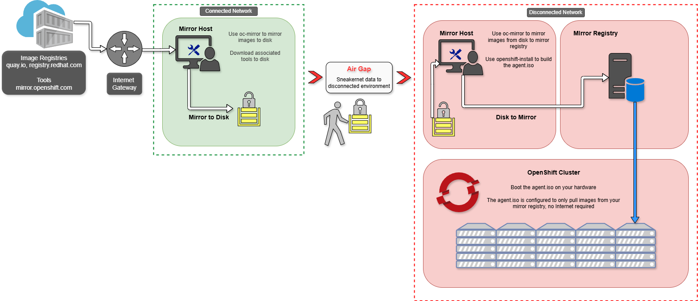

---
hide:
  #- navigation
  - toc
---
# Installing OpenShift in a Disconnected/Air-Gapped Environment: Streamlined
This documentions purpose is for consolidating information to stand up a OpenShift v4.12 and later cluster in a disconnected/air-gap environment using the agent-based installer. 

This in not a one-size fits all, this is not specific to any team/org, this is rough and simple to at least put the important things to know in one centralized document. 

Relevant docs/articles will be linked in each section if applicable.

---

